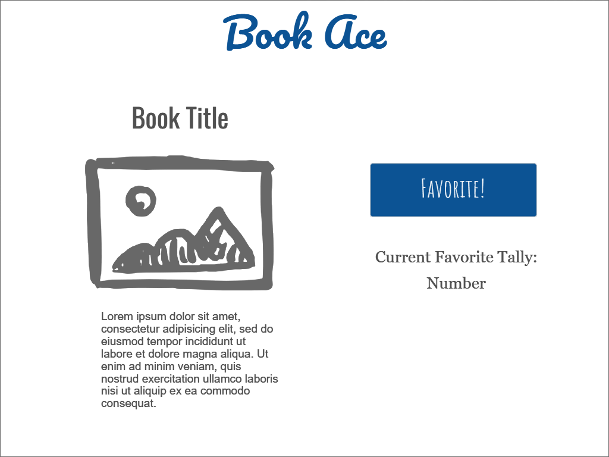

# Library Ace

[My Notes](notes.md)

This application allows a user to select and "favorite" one book. After a user selects their favorite title, the favorite count is added to for that book. Users are able to see the most loved books, allowing them to find their next read. Users can browse through the selection of books, gaining valuable information such as title, author, and summary.

## 🚀 Specification Deliverable

For this deliverable I did the following. I checked the box `[x]` and added a description for things I completed.

- [x] Proper use of Markdown
- [x] A concise and compelling elevator pitch
- [x] Description of key features
- [x] Description of how you will use each technology
- [x] One or more rough sketches of your application. Images must be embedded in this file using Markdown image references.

### Elevator pitch

Done with reading books that are just okay? Done with searching through ratings and videos to find a book worth your time? Through Library Ace, you can find the best of the best! Each user gets one book to favorite, and that's it! Choose your favorite book that you think everyone needs to read and you will be helping others find only the best books. See what books are the most beloved in the community, and find something that is worth your time to read.

### Design

### Key features

- Secure login over HTTPS
- Ability to favorite a most-loved book
- Stores and totals favorites
- Displays basic title information

### Technologies

I am going to use the required technologies in the following ways.

- **HTML** - Uses correct HTML structure for application. Three HTML pages. One for login, one for books, one for rankings. Hyperlinks to choice artifact.
- **CSS** - Application styling that looks appropriate on different screen sizes, uses good whitespace, color choice and contrast.
- **React** - Provides login, applying favorite, display other users favorites, and use of React for routing and components.
- **Service** - Backend service with endpoints for:
    - login
    - submitting favorite
    - retrieving favorites status
- **API** - Going to use Goodreads API to get book information, such as titles, author, and summary.
- **DB/Login** - Store users and favorites in database. Register and login users. Credentials securely stored in database. Can't vote unless authenticated.
- **WebSocket** - When a new book becomes the number one favorited, that book is broadcast to all users.

## 🚀 AWS deliverable

For this deliverable I did the following. I checked the box `[x]` and added a description for things I completed.

- [x] **Server deployed and accessible with custom domain name** - [My server link](https://libraryace.click).

## 🚀 HTML deliverable

For this deliverable I did the following. I checked the box `[x]` and added a description for things I completed.

- [x] **HTML pages** - Created a home page, a book page, and a ranking page.
- [x] **Proper HTML element usage** - Used headers, menu, table, and more elements throughout the HTML.
- [x] **Links** - Links to each available page, project GitHub, and an image link all properly utilized.
- [x] **Text** - Text is all filled in, with some generic text being used to represent a summary or title.
- [x] **3rd party API placeholder** - Book information was left intentionally blank, as API will fill this information in.
- [x] **Images** - Image of a book properly displayed and given alt text on My Book page.
- [x] **Login placeholder** - Both username and password taken. Once logged in, taken to My Book HTML page.
- [x] **DB data placeholder** - Top favorited books are shown in a table in the rankings page.
- [x] **WebSocket placeholder** - Recently favorited books and who favorited them are shown on the rankings page.

## 🚀 CSS deliverable

For this deliverable I did the following. I checked the box `[x]` and added a description for things I completed.

- [x] **Header, footer, and main content body** - All HTML content is formatted and present.
- [x] **Navigation elements** - Navigation bar sends user to all pages, and shows active page.
- [x] **Responsive to window resizing** - Window can be resized to show all content, no content is hidden by navigation bar when resizing.
- [x] **Application elements** - Created consistent coloring and branding, charts and buttons.
- [x] **Application text content** - Text is thoughtfully designed and formatted with CSS and colored.
- [x] **Application images** - Created a custom button that matches Bootstrap buttons but with Library Ace brand colors.

## 🚀 React part 1: Routing deliverable

For this deliverable I did the following. I checked the box `[x]` and added a description for things I completed.

- [x] **Bundled using Vite** - Correctly bundled program using Vite, matching expected format.
- [x] **Components** - All HTML components have been transfered over.
- [x] **Router** - Routinged between login and voting components correctly.

## 🚀 React part 2: Reactivity

For this deliverable I did the following. I checked the box `[x]` and added a description for things I completed.

- [ ] **All functionality implemented or mocked out** - I did not complete this part of the deliverable.
- [ ] **Hooks** - I did not complete this part of the deliverable.

## 🚀 Service deliverable

For this deliverable I did the following. I checked the box `[x]` and added a description for things I completed.

- [ ] **Node.js/Express HTTP service** - I did not complete this part of the deliverable.
- [ ] **Static middleware for frontend** - I did not complete this part of the deliverable.
- [ ] **Calls to third party endpoints** - I did not complete this part of the deliverable.
- [ ] **Backend service endpoints** - I did not complete this part of the deliverable.
- [ ] **Frontend calls service endpoints** - I did not complete this part of the deliverable.

## 🚀 DB/Login deliverable

For this deliverable I did the following. I checked the box `[x]` and added a description for things I completed.

- [ ] **User registration** - I did not complete this part of the deliverable.
- [ ] **User login and logout** - I did not complete this part of the deliverable.
- [ ] **Stores data in MongoDB** - I did not complete this part of the deliverable.
- [ ] **Stores credentials in MongoDB** - I did not complete this part of the deliverable.
- [ ] **Restricts functionality based on authentication** - I did not complete this part of the deliverable.

## 🚀 WebSocket deliverable

For this deliverable I did the following. I checked the box `[x]` and added a description for things I completed.

- [ ] **Backend listens for WebSocket connection** - I did not complete this part of the deliverable.
- [ ] **Frontend makes WebSocket connection** - I did not complete this part of the deliverable.
- [ ] **Data sent over WebSocket connection** - I did not complete this part of the deliverable.
- [ ] **WebSocket data displayed** - I did not complete this part of the deliverable.
- [ ] **Application is fully functional** - I did not complete this part of the deliverable.
